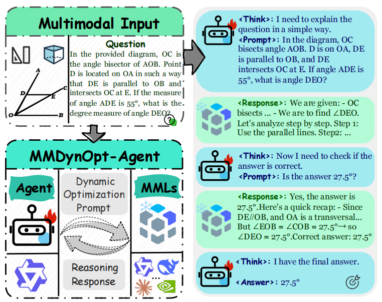
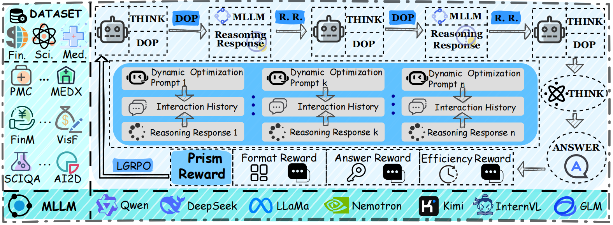

# MMDynOpt: Dynamic Multi-turn Optimization for Multimodal LLM Agents

<div align="center">

[]()
[]()
[]()
[]()

### **MMDynOpt**: End-to-End Reinforcement Learning for Dynamic Multi-turn Multimodal Agent Optimization

[📄 Paper]() | [🚀 Quick Start](#quick-start) | [💬 Contact](mailto:wenjinliu23@outlook.com)

</div>

---

## Overview

<div align="center">
  
  <p><b>Figure 1:</b> An example of MMDynOpt-Agent. The agent enhances MLLM reasoning by dynamically optimizing prompts.</p>
</div>

**MMDynOpt** addresses a fundamental challenge in multimodal AI agents—how to dynamically optimize the interaction strategy between a policy LLM and external multimodal tools over multiple turns. **MMDynOpt** is an **end-to-end reinforcement learning (RL)** framework built on [veRL](https://github.com/volcengine/verl) that trains small-scale LLMs to act as adaptive agents, learning when and how to query external multimodal LLMs, refine prompts, and aggregate evidence across multiple reasoning rounds. By leveraging **GRPO (Group Relative Policy Optimization)** with carefully designed reward signals—including format adherence, answer correctness (EM/F1), and inference budget penalties—**MMDynOpt** produces agents that achieve strong task-solving performance while maintaining computational efficiency.

<div align="center">
  
  <p><b>Figure 3:</b> Overview of the MMDynOpt-Agent framework. A multimodal agent is trained via reinforcement learning to dynamically generate optimized prompts for MLLMs. DOP: dynamic optimization prompt. R. R.: reasoning response.</p>
</div>

By integrating **dynamic multi-turn agent interaction** with **reinforcement learning**, **MMDynOpt** offers a **plug-and-play framework** that supports both **training** and **evaluation** with various multimodal LLMs serving as the external environment.

## Installation

### Environment Setup

```bash
conda create -n mmdynopt python==3.12 -y
conda activate mmdynopt
pip install verl>=0.4.0
pip install -r requirements.txt
pip install flash-attn --no-build-isolation
```

Set `PYTHONPATH` so the package is importable (from the `MMDynOpt` directory):

```bash
export PYTHONPATH="$(pwd):${PYTHONPATH}"
```

### Dataset Preparation

> Our datasets are organized as follows:

```bash
Training Dataset:   datasets/train.parquet    (11,520 samples)
Validation Dataset: datasets/val.parquet      (1,152 samples)
Evaluation Dataset: eval_data/                (15 benchmarks × 128 samples each)
```

The evaluation suite covers **15 multimodal benchmarks** across diverse domains:

| Domain | Benchmarks |
|--------|-----------|
| 💰 Finance | FinChart-Bench, FinMME, VisFinEval, finance-QA-Vision |
| 🏥 Medical | MedXpertQA, OmniMedVQA, PMC-VQA, PathVQA, VQA-RAD |
| 🔬 Science | ScienceQA, GEOQA, SeePhys |
| 📐 Math & Vision | MathVista, MULTI-Benchmark, AI2D |

## Quick Start

### 1. Configure the External Multimodal LLM

Edit `mmdynopt_agent/utils/tools/mm_LM_env.py` to set your API credentials:

```python
API_KEY = "your_api_key"
MODEL = "model_name"
BASE_URL = "url"
```

> This is the external multimodal LLM that the agent learns to query. For local deployment, see [Local Model Deployment](#local-model-deployment).

### 2. Training

Edit `mmdynopt_agent/scripts/run.sh` and configure:

```bash
export BASE_MODEL='/path/to/your/base_model'       # Policy LLM to be trained
export TRAIN_DATA_PATH=datasets/train.parquet
export VAL_DATA_PATH=datasets/val.parquet
```

> Run:

```bash
bash mmdynopt_agent/scripts/run.sh
```

Key training parameters (configurable in `run.sh`):
- `algorithm.adv_estimator=grpo` — Group Relative Policy Optimization
- `actor_rollout_ref.rollout.n=4` — number of samples per prompt
- `actor_rollout_ref.rollout.max_gen_round=5` — max agent interaction turns
- `trainer.reward_mode="EM"` — reward mode (EM / F1 / format+answer)

### 3. Local Model Deployment

To deploy the external multimodal LLM locally via vLLM:

```bash
# Create environment
conda create -n vllmapi python=3.12 -y
conda activate vllmapi

# Install dependencies
pip install vllm transformers accelerate

# Start the OpenAI-compatible server
nohup bash vllm_api.sh > api.out 2>&1 &
```

Then update `mmdynopt_agent/utils/tools/mm_LM_env.py`:

```python
BASE_URL = "http://<SERVER_IP>:8006/v1"
MODEL = "your-local-model-name"
```

## Evaluation

### 1. Merge Checkpoint

```bash
export CHECKPOINT_DIR='checkpoints/MMDynOpt/global_step_XX/actor'
export HF_MODEL_PATH='./Qwen/Qwen3-4B'
export TARGET_DIR='./merge_model/MMDynOpt_Qwen3-4B'
bash model_merge.sh
```

### 2. Batch Evaluation

Edit `mmdynopt_agent/scripts/eval.sh`:

```bash
MODEL_PATH=/path/to/your/base_model
CHECKPOINT_PATH=/path/to/your/checkpoint
VAL_DATA_DIR=/path/to/your/eval_data
RESULTS_BASE_DIR=/path/to/your/results_dir
```

Run:

```bash
bash mmdynopt_agent/scripts/eval.sh
```

The script iterates over all 15 benchmarks in `eval_data/`, runs inference with the trained agent, and saves per-benchmark `res.json` files.

### 3. Aggregate Results

```bash
python -m mmdynopt_agent.scripts.eval --res-dir ./your_results_dir
```

## Project Structure

```
MMDynOpt/
├── datasets/                    # Training & validation data
├── eval_data/                   # 15 multimodal benchmark datasets
├── mmdynopt_agent/
│   ├── prompts/                 # Initial system prompts
│   ├── scripts/                 # Training & evaluation launch scripts
│   ├── trainer/multimodal/      # PPO/GRPO training loop (veRL-based)
│   ├── utils/
│   │   ├── dataset/             # RL dataset loaders
│   │   ├── reward_score_mm/     # Reward computation (EM, F1, format, budget)
│   │   └── tools/               # External multimodal LLM interface
│   ├── workers/multimodal/
│   │   ├── actor/               # FSDP actor worker
│   │   ├── reward/              # Reward scoring worker
│   │   └── rollout/             # vLLM multi-turn rollout worker
│   └── monkey_patch/            # veRL compatibility patches
└── requirements.txt
```

## Reward Design

MMDynOpt employs a composite reward function:

| Component | Description |
|-----------|-------------|
| **Format Reward** | Encourages structured output with `<redacted_thinking>`, `<prompt>`, and `<answer>` tags |
| **Answer Reward** | EM (Exact Match) or F1 score against ground truth |
| **Budget Penalty** | Penalizes excessive LLM calls and token usage to encourage efficient agent behavior |

## BibTeX

If you find this work helpful for your research, please cite:

```bibtex
@misc{mmdynopt2025,
      title={MMDynOpt: Dynamic Multi-turn Optimization for Multimodal LLM Agents via End-to-end Reinforcement Learning},
      author={},
      year={2025},
      archivePrefix={arXiv},
      primaryClass={cs.CL},
}
```

For further questions, please contact: wenjinliu23@outlook.com.

## Acknowledgement

This repo benefits from [veRL](https://github.com/volcengine/verl), [Agent-R1](https://github.com/0russwest0/Agent-R1), [Search-R1](https://github.com/RUCAIBox/R1-Searcher), and [Prompt-R1](https://github.com/QwenQKing/Prompt-R1). Thanks for their wonderful works.
